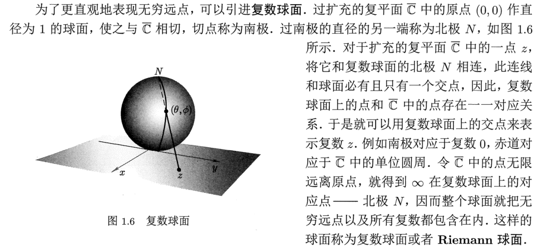

## 第一章：复变和复变函数

### 1.1 复数与复数运算

1. 复数的定义：

   - 有序实数对(x,y)遵从以下规则：

     $$(x_1,y_1)+(x_2,y_2)=(x_1+x_2,y_1+y_2)$$

     $$(x_1,y_1)(x_2,y_2)=(x_1x_2-y_1y_2,x_1y_2-y_1x_2)$$

     则有序实数对(x,y)定义了一个复数$z=(x,y=x(1,0)+y(0,1)$，其中x称为z的实部，y称为z的虚部。

     记作：$x=Rez,y=Imz$

   - 复数相等的条件：实部和虚部分别相等

2. 特殊的复数：1，i，0

   - 当y=0时，$(x,0)=x(1,0)=x$为实数，如实数1
   - 当x=0时，记$i =(0,1)$,$z=(0,y)=y(0,1)=iy$，称为纯虚数
   - 故复数可以表示成$z=x+iy$
   - 由复数的运算法则可知$i^2=-1$
   - 复数都存在其相反数$-z=(-x,-y)$

3. 加法与乘法：

   - 由定义可知
   - 复数的运算也满足交换律，结合律和分配律
   - 乘方和开方定义与实数类似

4. 共轭复数与复数除法：

   - 共轭复数：$z^*=x-iy$与$z=x+iy$互称共轭复数

   - 共轭复数的性质：

     - $(z^*)^*=z$
     - $(z_1\pm z_2)^*=z_1^* \pm z_2^*$
     - $(z_1z_2)^*=z_1^*z_2^*$
     - $z+z^*=2Re(z)$，$z-z^*=2iIm(z)$

   - 利用共轭复数可以计算复数的除法：

     $$\frac{x_1+iy_1}{x_2+iy_2}=\frac{(x_1+iy_1)(x_2-iy_2)}{(x_2+iy_2)(x_2-iy_2)}=\frac{x_1x_2+y_1y_2}{x_2^2+y_2^2}+i\frac{y_1x_2-x_1y_2}{x_2^2+y_2^2}$$

### 1.2 复数的几何表示

1. **复平面：**
   - **复平面**：用一个二维平面，横轴为x（称为**实轴**），纵轴为y（称为**虚轴**）
   - 因此，复数可以用复平面上的一个**点表示**
   - 复数也可以用复平面上的**矢量**来表示。因此复数的加法转化成矢量的加法，满足三角形法则/平行四边形法则，复数的减法可以转化成矢量的减法。
2. **因此衍生出复数的极坐标表示：**
   - $x=r\cos\theta$   $y=r\sin\theta$  $z=r(\cos\theta+i\sin\theta)$
   - 因此复数可以用$\theta$和$r$表示
     - r称为**模**
     - $\theta$称为**辅角**，由于三角函数的周期性，辅角不止一个，因此把位于$(-\pi,\pi]$之间的辅角值称为辅角的**主值**
   - 复数的乘法：$z_1z_2=r_1r_2(\cos(\theta_1+\theta_2)+i\sin(\theta_1+\theta_2))$
   - 复数的除法：$\frac{z_1}{z_2}= \frac{r_1}{r_2}(\cos(\theta_1-\theta_2)+i\sin(\theta_1-\theta_2))$

3. **由欧拉公式衍生出复数的指数表示**：
   - 复数可以表示成：$z=re^{i\theta}$

   - 同理，r为复数的模，$\theta$为复数的辅角

   - 其满足指数函数同样的性质，如乘法和除法
4. **负球面：**

### 1.3 区域

1. **区域的定义：**平面点集D作为一个区域
   - D是一个开集
   - D是连通的，即D中任何两点都可以用完全属于D的一条折线连接起来
2. **边界：**
   - 边界点：P点不属于D，但是在P的任意小领域内总包含D中的点，则称P点为区域D的边界点
   - D的所有边界点构成D的边界
3. **闭区域：**区域D和它的边界构成闭区域，记作$\overline D$
4. **单连通域和多连通域**
   - 单连通域：如果在区域内任意画一条闭合曲线（像一个圈），这条曲线都可以在不离开该区域的情况下，连续收缩成一个点
   - 多连通域：如果区域内存在某些闭合曲线，**无法**在不离开区域的情况下收缩成一个点

### 1.4 复变函数

1. **复变函数**：

   - 如果对于区域 G 内的每一个复数 z ， 都有唯一一个复数 ω 与之对应， ω 和 z 之间的这种对应关系记为 f， 则称 f 为定义在 G 上的复变函数。

   - 定义域：区域G称为函数f的定义域
   - 复变函数相当于定义了两个二元实变函数：
     - 给定$z=x+iy$,对应的复数$w=u+iv$
     - 相当于定义了两个二元实变函数$u(x,y)$ $v(x,y)$

2. 通常，函数着重于说明复数与复数之间的对应关系.为了强调点与点之间的对应关系，我们也常把函数 ω = f(z) 称为映射(或变换) ，记为 $f:z\to w$

   其中 ω 称为 z 在映射 f 下的像 ，z称为 ω 的原像

   给定一个自变量值，许可有多个函数值与之对应.这种对应关系，称为**多值函数**

