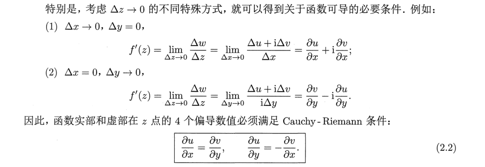

## 第二章：解析函数

### 2.1 复变函数的极限和连续
1. **极限**：若函数f(z)在$z_0$的空心领域内有定义，若存在复数A，$\forall \epsilon>0$,$\exists \delta(\epsilon)>0$使得当$0<|z-z_0|<\delta$,恒有$|f(z)-A|<\epsilon$,则称A为$z\to z_0$时的极限。记作$\lim\limits_{z\to z_0}=A$
   - 定理1: $\lim\limits_{z\to z_0}=A$的充要条件是$\lim\limits_{x \to x_0,y \to y_0}u(x,y)=u_0$ $\lim\limits_{x \to x_0,y \to y_0}v(x,y)=v_0$
   - 定理2：加减乘除的极限等于极限的加减乘除

2. **连续**：函数f(z)在$z_0$附近的领域内有定义，且$\lim\limits_{z\to z_0}f(z)=f(z_0)$,则称f(z)在$z_0$点连续.
   - 若函数 f 在区域 G 内每一点都连续，则称 f 为 G 内的连续函数
   - $f(z)=u(x,y)+iv(x,y)$在$z_{0}=x_{0}+iy_{0}$处连续的充要条件是$u(x,y)、v(x,y)$在$(x_{0},y_{0})$处连续
   - 连续函数的和、差、积、商(在分母不为零的点)仍为连续函数
   - 连续函数的复合函数也仍为连续函数.

### 2.2可导与可微

1. **可导**：

   - **定义**：设 ω = f(z) 是区域 G 内的单值函数，如果在 G 内的某点 z ，$\lim\limits_{\Delta z \to 0}\frac{\Delta w}{\Delta z}=\lim\limits_{\Delta z \to 0}\frac{f(z+\Delta z)-f(z)}{\Delta z}$存在，则称f(z)在该点可导，该极限值称为该点的导数

     - 导数的定义在形式上和实数中一样，只是把实自变量换成了复自变量，因此**高等数学中的各种求导数的公式都可搬用到复变函数中来**。
     - **注意**：上面所说的极限存在，就意味着$\Delta z$ 以**任意方式趋于0**时，$\frac{\Delta w}{\Delta z}$都趋于同样的有限值.反过来说，如果当$\Delta z$以不同方式趋于 0 ，该极限趋于不同的值的话，则**该极限不存在**

   - **柯西黎曼条件**：函数可导的**必要条件**

     

     - Cauchy - Riemann 条件是函数可导的必要条件，但不是充分条件
     - 如果函数 `f(z) = u(x, y) + iv(x, y)` 满足：（1） `f(z)` 在点 `z` **满足柯西-黎曼条件**。  （2） 实部 `u(x, y)` 和虚部 `v(x, y)` 作为二元实函数，在点 `(x, y)` **是可微的**(四个偏导数都存在且连续)。那么，函数 f(z) 在点 z 必定可导。
     - 函数可导是比函数连续更强的条件。如果函数 f(z) 在 z 点可导，则在 z
       点必连续。但是函数 f(z) 在 z 点连续，并不能推出函数 f(z) 在 z 点可导

2. **可微**：

   - 定义：$\Delta w=A(z)\Delta z+\rho(\Delta z)$ 其中$\lim\limits_{\Delta z \to 0}\frac{\rho(\Delta z)}{\Delta z}=0$ 则称w=f(z)在该点可微，$\Delta w$的线性部分$A(z)\Delta z$称为w在z点的微分。记作：

     $$dw=A(z)\Delta z$$
   - 在某点可导和可微是完全等价的。
### 2.3 解析函数

- **定义**：在区域 G 内处处可导的函数，称为 G 内的解析函数

- **奇点**：`f(z)`不解析的点 

- **函数在 G 内解析的必要条件**是在 G 内处处满足 Cauchy - Riemann 条件：$u_x = v_y \quad \text{且} \quad u_y = -v_x$

	- 由柯西黎曼条件可知：**解析函数的实部和虚部是相互关联的**： 

  $$dv=\frac{\partial v}{\partial x}x+\frac{\partial v}{\partial y}y=-\frac{\partial u}{\partial y}x+\frac{\partial u}{\partial x}y$$
	- 

  $$\frac{\partial^2 u}{\partial x^2}+\frac{\partial^2 u}{\partial y^2}=0$$

  $$\frac{\partial^2 v}{\partial x^2}+\frac{\partial^2 v}{\partial y^2}=0$$

  解析函数的实部和虚部都必须是调和函数。而且，因为一个解析函数的实部和虚部必须受到Cauchy - Riemann 方程的制约，所以，解析函数的实部和虚部就构成一对共轭调和函数。

### 2.4 初等函数

1. **指数函数**：

   ​	$$ e^z=e^x e^{iy}=e^x(\cos y+i\sin y)$$

   - **加法定理**，对于复指数函数仍然成立
   - 复指数函数具有**周期性**：周期为$2\pi i$
   - $e^z$在C内解析，在无穷远处无定义，因此也不解析。（当z沿正实轴或者负实轴趋于无穷时，$e^z$逼近不同的数值）。

2. **对数函数**：
$$Ln z=\ln|z|+iArgz$$
- 一般情况下，复数的对数函数为多值函数，因为`Argz`具有周期性。如果Argz取主值$argz$，则Lnz为单值函数。
- 拥有的性质：$Ln(z_{1}z_{2})=Lnz_{1}+Lnz_{2}、Ln\left(  \frac{z_{1}}{z_{2}}  \right)=Lnz_{1}-Lnz_{2}$
- 不再拥有的性质：$Lnz^n=nLnz、Ln \sqrt[n]{ z }=\frac{1}{n}Lnz$不再成立
- Lnz的各分支在除了原点和负实轴的平面内解析

3. **乘幂与幂函数**：
- $a^b=e^{bLna}=e^{\ln a}[\cos b(arga+2k\pi)+i\sin b(arga+2k\pi)]$
- 所以乘幂可能具有多个值
- 根式的定义与此相同
- $z^n$在平面内是单值解析函数，在除了原点和负实轴外的复平面内解析
- $\sqrt[n]{z  }$是个多值函数，各分支在除了原点和负实轴外的复平面内解析

4. **三角函数**：
   
   - 定义：$\sin z=\frac{e^{iz}-e^{-iz}}{2i}$  $\cos z=\frac{e^{iz}+e^{-iz}}{2}$
   - $sin z$ 、$cosz$在C内解析，无穷远点为唯一奇点
   - **周期性**：和实三角函数一样，sinz 和 cosz 也都是周期函数，周期为$2\pi$
   - $\cos z$是偶函数， $\sin z$是奇函数
   - **三角函数的大部分性质都可以使用**
   - 和实三角函数不同，sinz 和 cosz 的**模可以大于1**
   - 可以用sinz和cosz定义其他三角函数：$\tan z=\frac{\sin z}{\cos z}$等等
5. **双曲函数**：
   
   - $\sinh z=\frac{e^z-e^{-z}}{2}$   $\cosh z=\frac{e^z+e^{-z}}{2}$ $\tanh z=\frac{\sinh z}{\cosh z}$
   - 双曲函数可以和三角函数互化：$\sinh z= -i \sin iz$ $\cosh z=cos iz$ $\tanh z=-i\tan iz$
   - 性质：
     - 周期性，双曲函数sinh z , cosh z , sech z 和 cschz 的周期是$2\pi i$，tanhz 和 cothz 的周期是$\pi i$;
