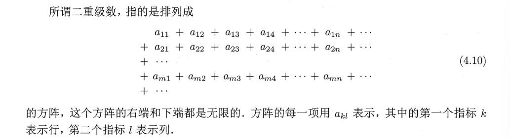

## 第四章：无穷级数

### 4.1 复数级数
1. **复数级数**：
    $$\sum_{n=0}^{\infty}u_n=u_0+u_1+...+u_n$$
    $$\sum u_n=\sum \alpha_n+i\sum \beta_n$$
    一个复数级数完全等价于两个实数级数

  故级数$\sum_{n=0}^{\infty} u_n$收敛的充要条件等同于$\sum_{n=0}^{\infty} \alpha_n$和$\sum_{n=0}^{\infty} \beta_n$都收敛
- **复数级数的部分和**：
	$$S_n=u_0+u_1+u_2+...+u_n$$
	- 若部分和构成的序列{$S_n$}收敛，即$S=\lim\limits_{n\to \infty}$S_n，S称为级数的和，否则级数是发散的
	- **级数的收敛性完全等价于部分和序列的收敛性**
- **根据无穷级数收敛的Cauchy充要条件**：$\forall \epsilon>0$ $\exists 正整数n$ $\forall p\in N_+$
	$$|u_{n+1}+u_{n+2}+u_{n+3}+...+u_{n+p}|<\epsilon$$
	- 特别地，在上式中令p=1，可以得到**级数收敛的必要条件**：$\lim\limits_{n\to \infty}u_n=0$

 2. **一个收敛序列的子序列一定收敛**。
因此只要不改变求和次序，可将收敛级数并项，也就是说**可以给收敛级数任意添加括号**。但是不能随意去掉收敛级数中的括号。

3. **绝对收敛**：
- 定义：如果$\sum_{n=0}^{\infty}|u_n|$收敛，则称级数$\sum_{n=0}^{\infty}$绝对收敛
- **绝对收敛的级数一定收敛。反之，收敛级数不一定绝对收敛**
- 由于$\sum_{n=0}^{\infty}|u_n|$是实数级数，而且是正项级数，所以，可以运用高数中的判别方法
- 对于复变函数中的**幂级数** $\sum_{n=0}^{\infty} a_n (z-z_0)^n$，绝对收敛性具有特殊的意义： 
  - **收敛圆盘：** 幂级数存在一个**收敛半径** $R$。    
    - 在收敛圆盘 $|z-z_0| < R$ 内部，幂级数**绝对收敛**  。（绝对收敛的收敛半径和原幂级数的收敛半径一样）
    - 在收敛圆盘 $|z-z_0| > R$ 外部，幂级数发散 
    -  在收敛圆周 $|z-z_0| = R$ 上，级数可能绝对收敛、条件收敛或发散，需要具体分析 。

  -  **绝对收敛与一致收敛：** 幂级数在其收敛圆盘 $|z-z_0| < R$ 内部**绝对收敛**，并且在任何半径小于 $R$ 的闭圆盘 $\overline{D}(z_0, R') \subset D(z_0, R)$ 上**一致收敛**。   **一致收敛**是保证和函数具有良好性质（如解析性、可逐项求导积分）的关键。

 4. **绝对收敛判别方法**（高数中正项级数的判别方法）：
- **比较判别法**：若$\exists N\in  N$，对于$\forall n>N$，都有$|u_n|<v_n$，若$\sum_{n=0}^{\infty}v_n$ 收敛， 则$\sum_{n=0}^{\infty}u_n$绝对收敛。若$|u_n|>v_n>0$，而$\sum_{n=0}^{\infty}v_n$发散，则$\sum_{n=0}^{\infty}|u_n|$发散。
- **比值判别法**：若存在与n无关的常数p，则当$|\frac{u_{n+1}}{u_n}|<p<1$，级数$\sum_{n=0}^{\infty}|u_n|$收敛，即$\sum_{n=0}^{\infty}u_n$绝对收敛。当$|\frac{u_{n+1}}{u_n}|>p>1$时，级数$\sum_{n=0}^{\infty}u_n$ 发散（*因为模在一直增大）*。
- **DA判别法**（与比值判别法类似）：
	- 若$\overline\lim\limits_{n \to \infty}|\frac{u_{n+1}}{u_n}|<1$，级数$\sum_{n=0}^{\infty}u_n$绝对收敛。
	- 若$\underline\lim\limits_{n \to \infty}|\frac{u_{n+1}}{u_n}|>1$，级数$\sum_{n=0}^{\infty}u_n$发散。
	- 若$\overline\lim\limits_{n \to \infty}|\frac{u_{n+1}}{u_n}|=1$，绝对收敛性需利用Gauss判别法进一步检验
- **Gauss判别法**：若$\frac{u_n}{u_{n+1}}=1+\frac{\mu}{n}+O(n^{-\lambda})$，其中$\mu=a+ib$ $\lambda>1$
	- 若$a>1$，则级数$\sum_{n=0}^{\infty}u_n$绝对收敛
	- 若$a< 1$，则级数$\sum_{n=0}^{\infty}|u_n|$发散 
	- 若$a=1$，则级数$\sum_{n=0}^{\infty}|u_n|$*无法判断原有级数的收敛性*
- **Cauchy判别法**：
	- 若$\lim\limits_{n\to \infty}|u_n|^{1/n}<1$，则级数$\sum_{n=0}^{\infty}u_n$绝对收敛
	- 若$\lim\limits_{n\to \infty}|u_n|^{1/n}>1$，则级数$\sum_{n=0}^{\infty}|u_n|$发散
	- 若$\lim\limits_{n\to \infty}|u_n|^{1/n}=1$，则$\sum_{n=0}^{\infty}|u_n|$无法判断收敛性

5.  **绝对收敛级数的性质**
- 改换次序，依旧绝对收敛
- 可以把绝对收敛级数拆成几个子级数，每个子级数仍绝对收敛
- 两个绝对收敛级数之积仍然绝对收敛。$\sum_k u_k·\sum_l v_l=\sum_{k,l}u_kv_l$  
	- 同时绝对收敛性意味着可以按照任何顺序求和，其值不变。
	- 如可以按照$\sum_{k=0}^{\infty} u_k·\sum_{l=0}^{\infty} v_l=\sum_{n=0}^{\infty}w_n$ ，$w_n=\sum_{k=0}^{n}u_Kv_{n-k}$，这种情况下条件可以放宽：$\sum u_k$ $\sum v_l$都收敛，且其中之一绝对收敛；或$\sum u_k$ $\sum v_l$ $\sum w_n$都收敛.

### 4.2 二重级数
1. **二重级数的定义**：
2. **二重级数的部分序列和**：可以求出方阵前m行n列的和：$S_{mn}=\sum_{\substack{1\le k \le m \\ 1 \le l \le n}}a_{kl}$，称为这个二重级数的部分和序列。
   若$\lim\limits_{\substack{m \to \infty \\n \to \infty}}S_{mn}=S$,则称该部分和序列收敛。S就是这个二重级数之和。
3. 除了直接求部分和的极限，还可以通过累次求和的方式计算二重级数的和。
	-  **先对列求和，再对行求和 (Summing by Columns first)**:  $Σ_{k=1}^{\infty} (Σ_{l=1}^{\infty} a_{kl}) = lim_{m→∞} (lim_{n→∞} S_{mn})$
	  这也被称为“逐列求和”。 
	-  **先对行求和，再对列求和 (Summing by Rows first)**:$Σ_{l=1}^{\infty} (Σ_{k=1}^{\infty} a_{kl}) = lim_{n→∞} (lim_{m→∞} S_{mn})$ 
	  这也被称为“逐行求和”。
	- *即使二重级数收敛，某些行或列的和也不一定存在，因此累次求和的和也不一定存在*
	- *如果逐行和逐列求和的和都存在，这两个和数也不一定相等即和数与求和次序有关*
	- *即使逐列求和与逐行求和的和数相等，二重级数也不一定收敛*
	- **二重级数的和是否依赖于求和方式，原则上与级数是否绝对收敛有关。** 如果二重级数绝对收敛，则级数各项的先后次序可以重新排列，因而不同求和方式得到相同的和数。

### 4.3 函数级数
1. **函数级数的定义、收敛与发散**：
	- **定义**：一系列函数$u_k(z)$在区域G内有定义，相加形成的级数$\sum_{k=1}^{\infty}u_k(z)$
	- **某点处的发散和收敛**：对于G内某点$z_0$，若级数$\sum_{k=1}^{\infty}u_k(z_0)$收敛，则称级数$\sum_{k=1}^{\infty}u_k(z)$在$z_0$点收敛，反之则在该点发散
	- **区域内收敛**：如果级数$\sum_{k=1}^{\infty}u_k(z)$在G内每一点都收敛，则称级数在G内收敛。其和函数是G内的单值函数。
2. **一致收敛**：
	- **定义**：$\forall \epsilon>0$ $\exists 与z无关的N(\epsilon)$ 使得 $\forall n>N(\epsilon)$ $\forall z \in G$, 都有：$|S(z)-\sum_{k=1}^{n}u_k(z)|<\epsilon$，称在G内一致收敛
	- 显然，一致收敛的概念总是和一定的区域联系在一起的。级数的一致收敛性是它在一定区域内的性质
	- **如果一系列连续函数不一致收敛，它们的极限函数就有可能是“不连续”的。**
	- **Weierstrass的 M 判别法**：$\exists N>0$ ,$\forall k>N$  $\forall z \in G$ 有$|u_k(z)|<a_k$ ，且$a_k$与z无关，而$\sum_{k=1}^{\infty}a_k$收敛，则**级数$\sum_{k=1}^{\infty}$在G内绝对收敛且一致收敛。**
	- **性质**：
		- **连续性**：若$u_k(z)$在G内连续，且其级数在G内一致连续，则其和函数$S(z)=\sum_{k=1}^{\infty}$也在G内连续。所以一致收敛级数可以逐项求极限。
		 $$\lim\limits_{z \to z_0}\sum_{k=1}^{\infty}u_k(z)=\sum_{k=1}^{\infty}[\lim\limits_{z\to z_0}u_k(z)]$$
		- **逐项求积分**：
		 $$\int_C \sum_{k=1}^{\infty}u_k(z) dz=\sum_{k=1}^{\infty}\int_C u_k(z)$$
		- **逐项求导数**：若$u_k(z)$在$\overline G$内单值解析，且$\sum_{k=1}^{\infty}u_k(z)$在$\overline G$一致收敛，则该级数之和$f(z)$是G内的解析函数，则有f(z)的各阶导数可以逐项求导得到：
		 $$f^{(p)}=\sum_{k=1}^{\infty}u_k^{(p)}(z)$$

### 4.4 幂级数
1. **幂级数**：$\sum_{n=0}^{\infty}c_n(z-a)^n$

2. **Abel第一定理**：

   **如果$\sum_{n=0}^{\infty}c_n(z-a)^n$在某点$z_0$收敛**，则$\sum_{n=0}^{\infty}c_n(z-a)^n在圆|z-a|<|z_0-a|内绝对收敛$,$\sum_{n=0}^{\infty}c_n(z-a)^n在圆|z-a|\le r \quad(r<|z_0-a|)内一致收敛$
   **若级数$\sum_{n=0}^{\infty}c_n(z-a)^n$在某点$z_1$发散**。则在圆$|z-a|>|z_1-a|外处处发散$

3. **收敛半径**：在幂级数$\sum_{n=0}^{\infty}c_n(z-a)^n$的收敛点与发散点之间存在一个分界线，而且这个分界线一定是圆周。圆内区域称为幂级数的收敛圆。收敛圆的半径称为收敛半径。

4. **幂级数的性质**：
   
   - **幂级数在收敛圆内一定收敛，在收敛圆外一定发散。**
   - **在收敛圆的圆周上，级数可能在所有点都收敛，可能在所有点都发散，也可能在一部分点收敛，在另一部分点发散.**
   - **但不论哪种情况，幂级数的收敛圆的圆周上总肯定有和函数的奇点（不可导）。特别需要说明，即使在和函数的奇点处，幂级数仍然可能收敛**
   
5. **求收敛半径的方法**：

  - **根值法公式**：
    $$\beta=\lim\limits_{n\to \infty}|c_n|^{1/n}$$
    
    $$R=\frac{1}{\beta}$$
    
  - **比值法**：
    $$\beta=\lim\limits_{n \to \infty}|\frac{c_{n+1}}{c_n}|$$  
    
    $$R=\frac{1}{\beta}$$

6. 由于幂级数$\sum_{n=0}^{\infty}c_n(z-a)^n$的每一项在复平面 C 内都是 z 的解析函数， Abel 定理又告诉我们，幂级数在其收敛圆内内闭一致收敛，因此，根据3.4.3的 Weierstrass 定理，幂级数在**收敛圆内**代表了一个**解析函数**，**可以对幂级数逐项积分或逐项求导数，而收敛半径不变**
   

7. 需要明确一下(当收敛半径为有限值时) "和函数的奇点(或解析性)"这种说法的含义。

   毫无疑问，幂级数在收敛圆内收敛，在收敛圆外发散，因而*幂级数只在收敛圆内有定义*，并且代表了一个解析函数。

   另一方面，就和函数而言，尽管幂级数是在收敛圆内才收敛到和函数，但是，我们从来不会认为这个函数只是局限于收敛圆内才有定义(少数函数除外，例如，见第五章习题 10)。

   **事实上，幂级数只不过是这个函数在收敛圆内的一种表达形式，在其他区域内可以有其他表达形式**。我们总会自觉或不自觉地在整个定义域上来考察它的解析性。我们也正是在这个前提下，才能谈论函数在收敛圆周上乃至收敛圆外的奇点。一个幂级数的收敛半径，实际上就是由距离展开中心最近的那个函数奇点决定的。

### 4.5泰勒级数

1. **推导**：略

2. **泰勒展开定理**：设f(z)在区域D内解析，$z_0$ 为D内的一点，d为$z_0$到D的边界上各点的最短距离，但$|z-z_0|<d$时，$f(z)=\sum_{n=0}^{\infty}c_n(z-z_0)^n$,其中$c_n=\frac{1}{n!}f^{(n)}(z_0)$

3. **任何解析函数展开成幂级数的结果就是泰勒级数，是唯一的**。

4. **常见的泰勒级数：**

   - $e^{z} = \sum_{n=0}^{\infty} \frac{z^{n}}{n!} = 1 + z + \frac{z^{2}}{2!} + \frac{z^{3}}{3!} + \cdots$
   - $\sin(z) = \sum_{n=0}^{\infty} (-1)^{n} \frac{z^{2n+1}}{(2n+1)!} = z - \frac{z^{3}}{3!} + \frac{z^{5}}{5!} - \cdots$
   - $\cos(z) = \sum_{n=0}^{\infty} (-1)^{n} \frac{z^{2n}}{(2n)!} = 1 - \frac{z^{2}}{2!} + \frac{z^{4}}{4!} - \cdots$
   - $\frac{1}{1-z} = \sum_{n=0}^{\infty} z^{n} = 1 + z + z^{2} + z^{3} + \cdots$
   - (上式求导)$\ln(1+z) = \sum_{n=1}^{\infty} (-1)^{n-1} \frac{z^{n}}{n} = z - \frac{z^{2}}{2} + \frac{z^{3}}{3} - \cdots$
   - $(1+z)^{k} = \sum_{n=0}^{\infty} \binom{k}{n} z^{n} = 1 + kz + \frac{k(k-1)}{2!}z^{2} + \frac{k(k-1)(k-2)}{3!}z^{3} + \cdots$

### 4.6洛朗级数

1. **洛朗级数的由来**：为了处理f(z)在$z_0$处不解析，但是想展开成$z-z_0$的幂级数。

   可以考虑级数如$\sum_{n=-\infty}^{\infty}(z-z_0)^n$，将其分成正幂项和负幂项两个部分。

   正幂项的收敛级数是$R_1$,负幂项代换之后可转化成泰勒级数,其收敛半径为$R_2$，则整个级数的收敛范围为$\frac{1}{R_2}<R<R_1$，则整个级数的收敛范围为一个圆环。

   该级数的和函数是解析的，可以逐项求导和积分。

2. **洛朗级数定理**：若`f(z)`在圆环域$R_1<|z-z_0|<R_2$内解析，则`f(z)`可展开为$\sum_{n=-\infty}^{\infty}c_n(z-z_0)^n$

   其中$c_n=\frac{1}{2\pi i}\oint _C \frac{f(\zeta)}{(\zeta-z_0)^{n+1}}d\zeta$

   C为在圆环域内绕$z_0$的任意一条正向简单闭合曲线。

3. **洛朗级数的性质与应用**：

   - **级数的构成（Structure）：**

     洛朗级数由两部分组成：

      $$ f(z) = \underbrace{\sum_{n=0}^{\infty} c_n (z - z_0)^n}_{\text{解析部分 (Analytic Part)}} + \underbrace{\sum_{n=-\infty}^{-1} c_n (z - z_0)^n}_{\text{主要部分 (Principal Part)}} $$ 

     **解析部分**（正幂项）：对应于泰勒级数的部分，它在 $|z - z_0| < R$ 的圆盘内收敛。 

     **主要部分**（负幂项）：包含 $(z - z_0)$ 的负整数次幂，它在 $|z - z_0| > r$ 的区域外部收敛。

   - **唯一性**：在给定的圆环域内，如果函数 $f(z)$ 能展开为洛朗级数，那么这个展开式是**唯一**的。

   - **留数**：洛朗级数中 $n = -1$ 的系数 $c_{-1}$ 具有特殊的意义，被称为函数在 $z_0$ 处的**留数**，记作 $\text{Res}(f, z_0)$。

      根据系数公式： $ c_{-1} = \frac{1}{2\pi i} \oint_\C f(z) \, dz $  可得：$\oint_\C f(z) dz=2\pi i c_{-1} $这是留数定理的基础，用于计算复杂的围道积分。

   - **与泰勒级数的关系**：当 $f(z)$ 在 $z_0$ 处解析（即没有奇点）时，洛朗级数的主要部分消失（所有负幂项系数为 0），此时洛朗级数退化为泰勒级数。

4. **洛朗级数的求法**：通常不用公式求系数$c_n$，而是通过像求函数的泰勒展开式一样采用间接展开法。$\frac{1}{1-z}=\sum_{n=0}^{\infty}z^n ,(|z|<1)$

