# 逻辑代数与硬件描述语言基础

## 2.1 逻辑代数的基本定律和规则
### 2.1.1 逻辑代数的基本定律和恒等式
- 自等律：$A+0=A$  $A \cdot 1=A$
- 0-1律：$A+1=1$  $A \cdot 0=0$
- 重叠律：$A+A=A$ $A \cdot A =A$
- 互补律：$A+\overline{A}=1$  $A \cdot \overline{A}=0$
- 还原律：$\overline{\overline{A}}=A$
- 交换律：$A+B=B+A$  $A \cdot B= B \cdot A$
- 结合律：$(A+B)+C=A+(B+C)$ $(A \cdot B)\cdot C=A \cdot(B \cdot C)$
- 分配律：$A \cdot (B+C)=A \cdot B+A \cdot C$  $A+ B \cdot C=(A+B)\cdot (A+C)$（或对与分配）
- 吸收律：$A+A \cdot B=A$  $A \cdot (A+B)=A$
- **反演律（摩根定律）**：$\overline{A\cdot B \cdot C ...}=\overline{A}+\overline{B}+\overline{C}+...$
- 其他常用恒等式：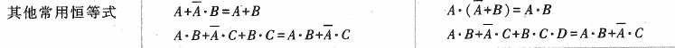

### 2.1.2 逻辑代数的基本规则或定理
1. **代入规则**：在任何一个逻辑等式中，如果用一个函数代替等式两边出现的某变量A,则等式依旧成立

2. **反演规则**：求原函数的非函数时，先将与运算和或运算对调，再把原变量换为非变量，把0和1互换，得到的就是原函数的非函数
   *注意以下原则*：
   - 保持原有的运算优先级
   - 对于非变量以外的非号保持不变
3. **对偶规则**：把原有表达式的与或互换，以及01互换就能得到一个原有表达式的对偶式。
**如果某个逻辑表达式相等，则它们的对偶式也相等**
4. **香农展开定理**：任何一个逻辑函数
$$f(x_1,x_2,...,x_{i-1},x_i,x_{i+1},...,x_n)=\overline{x_i}\cdot f(x_1,x_2,...,x_{i-1},0,x_{i+1},...,x_n)+x_i \cdot f(x_1,x_2,...,x_{i-1},1,x_{i+1},...,x_n) $$

## 2.2 逻辑函数表达式的形式
### 2.2.1 逻辑函数表达式的基本形式
1. **与-或表达式**：指的是由若干与项进行或运算构成的表达式
	- 与项：由与运算把变量连接起来的项
2. **或-与表达式**：指的是由若干或项进行与运算构成的表达式
	- 或项：由或运算把变量连接起来的项

### 2.2.2 最小项和最小项表达式
1. **最小项的定义和性质**：
	- **定义**：对于有n个变量的逻辑函数，若有一个**与项**包含了全部的n个变量，每个变量都以它的原变量和非变量的形式出现，且只出现一次，则称该乘积为最小项。
	- **性质**：
		- 任意一个最小项，只有一组输入可使其值为1,其他组均为0。并且，最小项不同，使其值为1的取值也不同
		- 任意两个不同最小项之积为0
		- 所有最小项之和为1
2. **最小项表达式**：
	- 定义：由若干个最小项**或运算**构成的逻辑表达式，也称与-或表达式
	- **任意表达式都变化成唯一的最小项表达式**

### 2.2.3 最大项与最大项表达式
1. 最大项的定义和性质
	- **定义**：对于有n个变量的函数，若有一个**或项**包含了全部的n个变量，每个变量都以它的原变量和非变量的形式出现，且只出现一次，则称该乘积为最小项。
	- 性质：
		- 任意一个最小项，只有一组输入可使其值为0,其他组均为1。并且，最小项不同，使其值为1的取值也不同
		- 任意两个不同的最大项之和为1
		- 所有最大项之积为0
2. 最小项和最大项的关系
	- 相同变量构成的最小项和最大项之间存在互补关系
3. **最大项表达式**
	- 定义：由若干个最大项**与运算**构成的逻辑表达式，也称或-与表达式
	- **任意表达式都变化成唯一的最大项表达式
4. 利用最大项法、最小项法从真值表写逻辑表达式

*   **最小项法**关注输出为 **1** 的行，并将这些行对应的项**相加**。
*   **最大项法**关注输出为 **0** 的行，并将这些行对应的项**相乘**

|    特性    |             最大项法 (POS / 和之积)              |             最小项法 (SOP / 积之和)              |
| :------: | :---------------------------------------: | :---------------------------------------: |
| **关注点**  |            输出 $Y$ 等于 **0** 的行             |            输出 $Y$ 等于 **1** 的行             |
| **项的结构** |              各变量的 **和**（OR）               |              各变量的 **积**（AND）              |
| **变量规则** | 0 $\rightarrow$ 变量本身；1 $\rightarrow$ 变量取反 | 1 $\rightarrow$ 变量本身；0 $\rightarrow$ 变量取反 |
| **最终运算** |              所有项 **相乘**（AND）              |              所有项 **相加**（OR）               |
在最大项法和最小项法中，其最大项和最小项是互补的

### 2.3 逻辑函数的代数化简法
直接求出来的逻辑函数式，往往并不是最简形式，因此，需要进行化简。
逻辑函数往往可以化成多种形式，通常化为与-或表达式。
1.逻辑函数的化简
	- 并项法：利用$A+\overline{A}=1$进行合并
	- 吸收法：利用$A+AB=A$
	- 消去法：利用$A+\overline{A}B=A+B$
	- 配项法：利用$A+\overline{A}=0$或$A\overline{A}=0$
2.逻辑函数形式的变换：常常现实中只存在一种门电路，因此要对逻辑表达式进行转化，如取两次反、利用摩根定理等。

### 2.4 逻辑函数的卡诺图化简法
### 2.4.1 卡诺图的引出
1.一个逻辑函数的卡诺图就是将次函数的最小项表达式相应地填入特定的方格图中，这个方格图称为卡诺图
2.卡诺图的画法：
	- 一个卡诺图有$2^n$个项
	- 折叠展开：
		- 新增加的方格按展开方向标以新变量
		- 新方格的最小项编号就是展开前编号加上$2^{n-1}$
	- 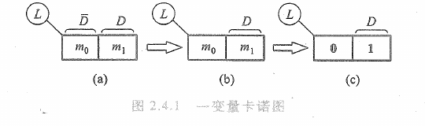
	- 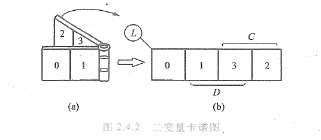
	- 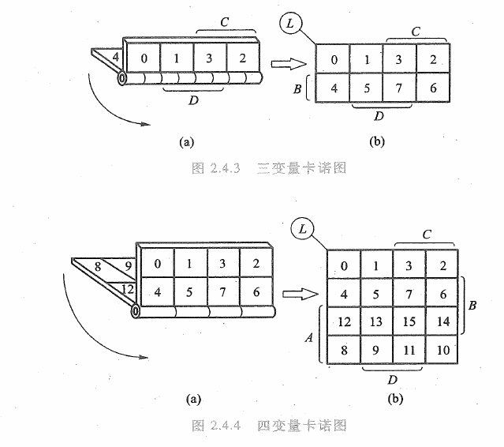
3.卡诺图的特点：
	- 几何位置相邻的最小项在逻辑上也是相邻的，即最小项只有一个变量不同
	- 在几何位置上，卡诺图具有上下、左右封闭的特性
4.已知逻辑函数，画出卡诺图
	首先画出变量卡诺图，然后把最小项对应的方格填入卡诺图，即可得到逻辑函数的卡诺图
	最小项编号为由其对应的逻辑表达式的二进制值。
### 2.4.2 用卡诺图化简逻辑函数
1.**化简的依据**：卡诺图具有相邻性，若两个相邻的方格均为1,则这两个最小项之和有一个变量可以消去。
2.**化简的步骤**：
	- 把逻辑函数写成最小项表达式
	- 按最小项填写卡诺图
	- 找出为1的相邻项，用虚线画出包围圈，包围圈包含$2^n$个方格，再写出对应的乘积项
	- 把所有包围圈对应的乘积项相加
	- 画圈的原则：
3.具有无关项的化简：
- **约束项**：有些变量取值是没有意义的（如8421码中的1010～1111），这种最小项称为约束项。
- **任意项**：有些变量取值在客观条件下不存在，其函数取值可以是任意的。
- **无关项**：约束项和任意项统称为无关项。
	- 通常用d表示
	- 其对应的函数值用x表示
- 无关项的值取0或1都可以，只需利于逻辑表达式的化简

## 2.5 硬件描述语言Verilog HDL基础
硬件描述语言（HDL）用与表示逻辑电路图，逻辑表达式等
- 计算机对HDL的处理常包含**逻辑仿真**和**逻辑综合**。
	- 逻辑仿真：计算机仿真软件对数字逻辑电路的结构和行为进行预测
	- 逻辑综合：高层次的、行为级的 HDL 描述自动转换为低层次的、结构化的门级网表的过程。
### 2.5.1 Verlog HDL模块的基本结构

模块是Verilog描述电路的基本单元。
定义模块常常使用如下结构：
``` 
module 模块名(端口名1、端口名2、端口名3);
端口模式说明(input,output,inout)
参数定义(可选)
数据类型定义(wire,reg等)

实例引用低层次模块或门级基本元件；
连续赋值语句(assign)；
过程块结构(initial或alaways)；
行为描述语句；
endmodule
```

***说明***：
- **模块名**：模块唯一的标志符
- **端口模式**：端口流经的方向：input,output,inout等等
- **参数定义**：把数值常量使用符号常量进行替换，增加可读性
- **数据类型定义**：wire（连线类型）、reg（寄存器类型）
- **逻辑功能的描述**：
	- **门级描述方法**：实例引用低层次模块或门级基本元件
	- **数据流描述方式**：使用连续赋值语句进行描述
	- **行为描述方式**：使用过程化语句结构，包括initial结构和always结构

***举例***（设计块）：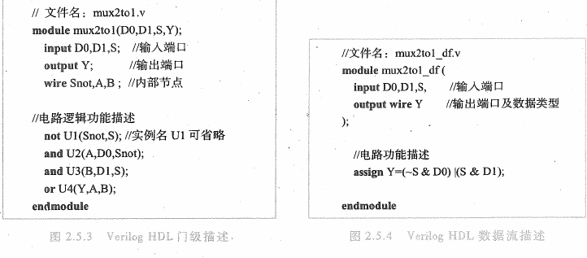

***新的模块声明方式***：
```
module 模块名 (
端口方向 数据类型 端口名
...
)
```

#### 2.5.2 逻辑功能的仿真和测试
- 为了对设计块的功能进行测试，需要在输入端口加入测试信号，这一过程称为**搭建数据平台**
- **激励块**：同样使用module开头和endmodule结尾，中间结构和设计块类似，单数不需要声明端口。
- 在激励块中常使用编译命令`` `timescale ``进行编译。`` `timescale ``的格式为：
  ```
  `time scale time_unit/time_precision
  ```
  - time_unit称为仿真时间单位
  - time_precision为仿真时间精度
  - 通常时间单位大于时间精度

举例：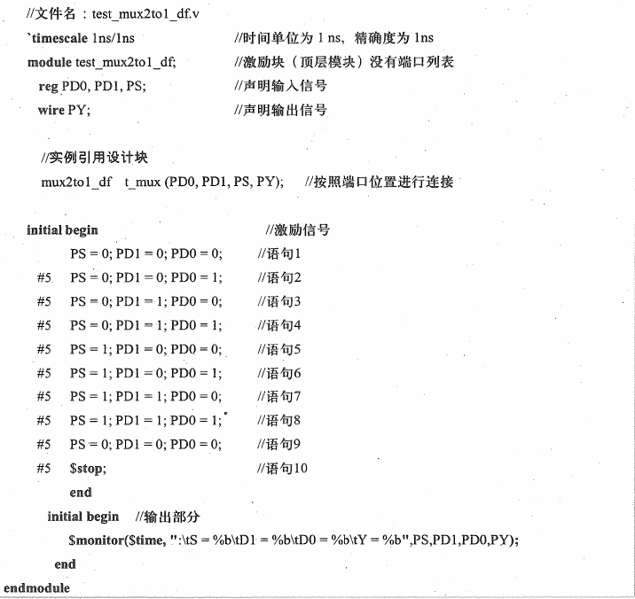
***说明***：
- **激励块名称**：test_mux2to1_df
- 输入信号要求为reg
- 输出信号要求为wire
- 实例引用设计块的格式：
	- 位置关联：`设计块名称 实例名（端口1,端口2,...)`
	- 命名关联：`设计块名称 实例名（.端口名（信号),...）`
- 使用initial语句进行激励信号的输入，格式：`initial begin ... end`
- 代码中的`$monitor $time`等是Verilog HDL的系统任务：
	- `$monitor`用于把信息以指定的形式输出到屏幕上
		- 格式和C语言类似
		- `\t`为制表符
		- `%b`表示使用二进制表示
	- `$time`返回当前的仿真时间
	- `stop`为停止仿真

### 2.5.3 Verilog HDL的基本语法规则
1. **间隔符**： 空格符`\b`,TAB键`\t`,换行符`\n`等。
2. **注释符**：`/* ....*/` 或者 `//`，这与C语言类似
3. **标识符和关键词**：
	- 标识符：给对象取名用的字符串
		- 由英文字母、数字、$、下划线组成
		- 第一个字母必须是英文字母或下划线
	- 关键词：Verilog本身规定的特殊字符串，如module、endmodule等等
4. **逻辑值表示**：
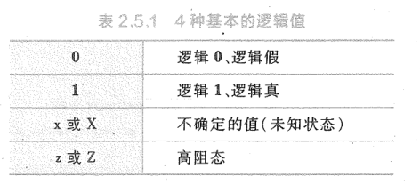
5. **常量及其表示**：
	- **整数型常量**：
		- 简单的十进制数形式表示整数，如30、-2
		- 带技术的形式表示整数：`<+/-> <size>'<signed> radix integer_number`
			- size：表示常数对于的二进制数的位数
			- signed：用小写s或大写S表示有符号的数
			- radix：`b/B`表示二进制数、`d/D`表示十进制数、`h/H`表示十六进制数等等
			- integer_number：基数格式下的数值（可以添加下划线）
	- **实数型变量**：
		- 使用十进制表示法：如0.1、2.0等
		- 使用科学记数法：如23_5.1e2、3.6E2
6. **参数**：由一个标识符和一个常量组成
	- 参数声明的格式：`parameter <signed> <msb;lsb> 参数名1=常量表达式1,参数2=常量表达式2，... `
	- 参数是局部的，只在声明的模块内部起作用。可以使用`defparam`语句来改变参数值
7. **字符串**：使用双引号包裹的字符序列。在表达式和复制语句中，字符串会转化成无符号整数。

### 2.5.4 数据类型
1. **线网类型**：硬件电路中元件之间实际连线的抽象。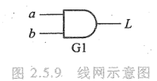
	- 线网的值由驱动元件决定，如果没有驱动元件连接到线网，则线网的默认值是高阻态z
	- 线网类型有：wire,wand,wor,tri等
	- 线网类型的的声明：`wire<signed><msb;lsb>net_name1,net_name2,...`
	- 如果输入输出的端口没有明确数据类型，则默认是1位宽的wire型。
2. **变量类型**：

| 寄存器类型          | 功能说明                                |
| -------------- | ----------------------------------- |
| reg            | 用于行为描述,表示存储逻辑值的变量。其值可以取 0, 1, x 和 z |
| integer        | 32 位带符号的整数型变量                       |
| real, realtime | 64 位带符号的实数型变量,默认值为 0                |
| time           | 64 位无符号的时间型变量                       |
reg的声明：`reg<signed><msb;lsb>reg_name1,...`
integer、real、realtime和time都是纯数学的抽象表示，不对应具体的硬件电路。
integer用于储存整数型变量，real/realtime用于储存实数型变量，不能定义位数，默认为0。
time一般用来储存仿真的时间，只储存无符号数，常常调用`$time`.

### 2.5.5 运算符及其优先级
1. 运算符：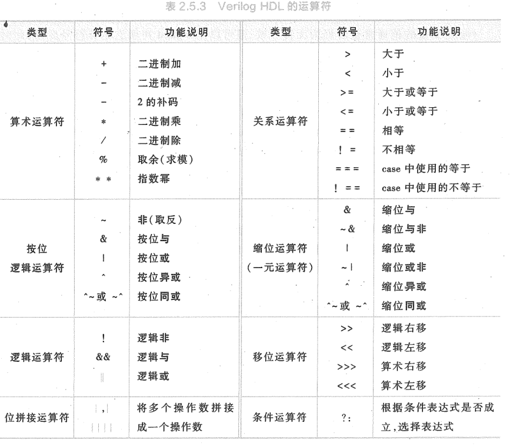
	- **按位运算符**：按位运算是“垂直”方向的，即第一个操作数的第n位与第二个操作数的第n位进行运算，生成结果的第n位。操作数是几位数，运算结果也是几位数。
	- **缩位运算符**：缩位运算是“水平”方向的，它将单个操作数的所有位串行地进行逻辑运算。一元运算符，对单个操作数进行相应运算，产生的结果是对应位数的数。
	- **逻辑运算**的结果为1位，用来判断条件的真假。如果是一位数，1代表逻辑1,0代表逻辑0。如果是多位数，则操作数的每一位都是0,代表该操作数具有逻辑0的值，操作数中有一位数是1,就代表该操作数具有逻辑1值。如果任何一个操作数为x或z，则逻辑运算的结果为x不定态x。
	- **位拼接运算符**的作用是将两个或多个信号的某些位拼接起来得到一个新的操作数：
		- 基本格式：`{A,B,C}`
		- 拼接某些位数：`{A,B[2],C[0]}`
		- 重复拼接：`{4{A}}`,`{3{A},4{B}}`
		- 参与拼接的操作数必须表明位宽
	- **关系运算**的结果是1位，用来判断条件的真假，如果结果是不确定的，结果将是x
	- **逻辑移位运算符**：空出的位用0填补
	- **算数移位运算符**：空出的位用左边最高位的数值来填补
2. 运算符的优先级：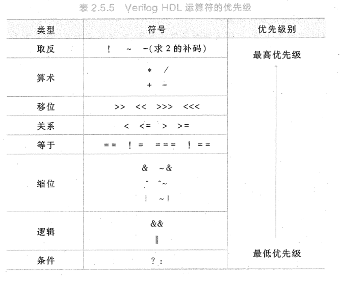

### 2.5.6 Verilog HDL 内部的基本门级元件
Verilog语言包含12个预先定义的基本门级元件
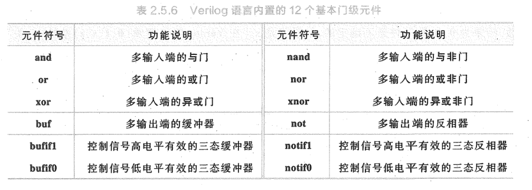1.多输入门：and,nand,or,xor和xnor都是多输入门。共同特点是：多输入，但是只有一个输出。
	- 调用形式为：`and A1(out,in1,in2,..)`
		- A1是实例名，可以省略
		- 后面括号中列出端口，输出端口在前，输入端口在后
	- and的逻辑：只有输入都是1时，输出才是1。如果有一个输入是x或者z，则输出是x
2.多输出门：buf、not是具有多个输出的逻辑门
	-调用形式为：`buf B1(out1,out2,...in)`
3.三态门：bufif1,bufif0,notif1和notif0是三态门元件，这种门拥有一个输出，一个数据输入和一个控制输入。如果输入信号无效，则三态门的输出为高阻态z。
	- 一般调用形式为：`bufif1 B1(out1,in,ctrl)
	- 具体逻辑关系在此处不多作解释