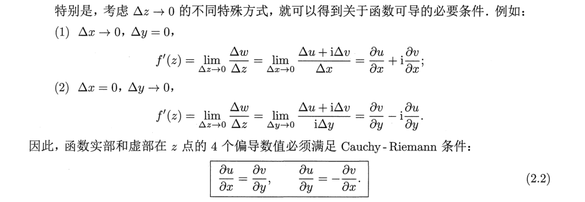
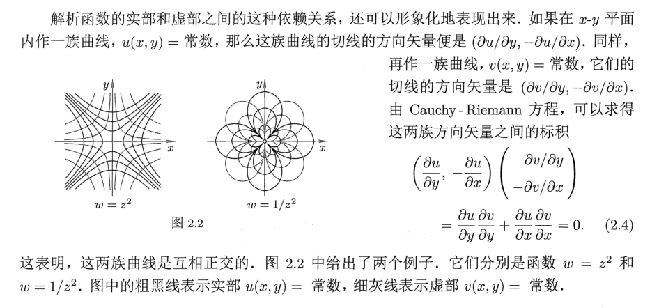

# 速通复变函数

## 第一章：复变和复变函数

### 1.1 复数与复数运算

1. 复数的定义：

   - 有序实数对(x,y)遵从以下规则：

     $$(x_1,y_1)+(x_2,y_2)=(x_1+x_2,y_1+y_2)$$

     $$(x_1,y_1)(x_2,y_2)=(x_1x_2-y_1y_2,x_1y_2-y_1x_2)$$

     则有序实数对(x,y)定义了一个复数$z=(x,y=x(1,0)+y(0,1)$，其中x称为z的实部，y称为z的虚部。

     记作：$x=Rez,y=Imz$

   - 复数相等的条件：实部和虚部分别相等

2. 特殊的复数：1，i，0

   - 当y=0时，$(x,0)=x(1,0)=x$为实数，如实数1
   - 当x=0时，记$i =(0,1)$,$z=(0,y)=y(0,1)=iy$，称为纯虚数
   - 故复数可以表示成$z=x+iy$
   - 由复数的运算法则可知$i^2=-1$
   - 复数都存在其相反数$-z=(-x,-y)$

3. 复数的**几何表示**

   - **复平面**：用一个二维平面，横轴为x（称为**实轴**），纵轴为y（称为**虚轴**）
   - 因此，复数可以用复平面上的一个**点表示**
   - 复数也可以用复平面上的**矢量**来表示。因此复数的加法转化成矢量的加法，满足三角形法则/平行四边形法则，复数的减法可以转化成矢量的减法。

4. 共轭复数与复数除法：

   - 共轭复数：$z^*=x-iy$与$z=x+iy$互称共轭复数

   - 共轭复数的小结论：

     - $(z^*)^*=z$
     - $z+z^*=2x$为实数，$z-z^*=2iy$为纯虚数

   - 利用共轭复数可以计算复数的除法：

     $$\frac{x_1+iy_1}{x_2+iy_2}=\frac{(x_1+iy_1)(x_2-iy_2)}{(x_2+iy_2)(x_2-iy_2)}=\frac{x_1x_2+y_1y_2}{x_2^2+y_2^2}+i\frac{y_1x_2-x_1y_2}{x_2^2+y_2^2}$$

5. 复数的极坐标表示：

   - $x=r\cos\theta$  $y=r\sin\theta$
   - 因此复数可以用$\theta$和$r$表示
     - r称为**模**
     - $\theta$称为**辅角**，由于三角函数的周期性，辅角不止一个，因此把位于$(-\pi,\pi]$之间的辅角值称为辅角的**主值**
   - $z=r(\cos\theta+i\sin\theta)$
   - 复数的乘法
     - 模相乘，辅角相加
     - $z_1z_2=r_1r_2(\cos(\theta_1+\theta_2)+i\sin(\theta_1+\theta_2))$
   - 复数的除法
     - 模相除，辅角相减
     - $$\frac{z_1}{z_2}= \frac{r_1}{r_2}(\cos(\theta_1-\theta_2)+i\sin(\theta_1-\theta_2))$$

6. 复数的指数表示

   - 有欧拉公式，复数可以表示成：

     $$z=re^{i\theta}$$

   - 同理，r为复数的模，$\theta$为复数的辅角

   - 其满足指数函数同样的性质，如乘法和除法

### 1.2 复数序列

1. **复数序列**：按照一定顺序排列的无穷个复数：

   $$z_n=x_n+iy_n$$

   显然，一个复数序列完全等同与两个实数序列${x_n}$和${y_n}$

2. **聚点**：

   - 定义：对于序列{$z_n$},$\forall\epsilon>0$,$\exists z\in C$,恒有无穷个n使得$|z_n-z|<\epsilon$,则称z为该序列的聚点
   - 一个序列可以存在不止一个聚点
   - 对于实数序列{$x_n$}的聚点,数值最大的称为实数序列的上极限，记为$\overline{\lim\limits_{n\to\infty}}x_n$.数值最小的称为实数序列的下极限$\underline\lim\limits_{n\to\infty}x_n$

2. 有界序列和无界序列：给定序列{$z_n$},$\exists M>0$, 使得$\forall n$ $|z_n|<M$,则该序列为有界序列，否则为无界序列

3. **Bolzano - Weierstrass 定理**：一个有界序列至少有一个聚点.

4. 极限：

   - 给定序列{$z_n$} ,$\exists z$ $\forall \epsilon>0$ $\exists N(\epsilon)>0$ 当$n>N(\epsilon)$时，有$|z_n-z|<\epsilon$,则称z为该序列的极限，{$z_n$}收敛于z，记为$\lim\limits_{n\to\infty}z_n=z$
   - 一个序列的极限必然是此序列的聚点，而且是唯一的聚点.
   - 一个无界序列不可能是收敛的.不收敛的序列称为发散序列
   - **序列收敛的 Cauchy 充要条件**:$\exists \epsilon>0$,$N(\epsilon)\in N_+$,使得对于$\forall p\in N_+$,有$|z_{N+p}-z_N|<\epsilon$

### 1.3 复变函数

1. **点集**：复平面内点的集合

2. **内点**：如果以该点为圆心能够作一个圆，使得圆内所有的点都属于点集，则称该点为点集的内点

3. 区域：(1) 全部都由内点组成 (2) 具有连通性，即点集中任意两点，都可以用一条折线连接起来，且折线上的点全部属于此点集.

   - *单连通区域*:在区域内作任何简单闭合围道(自身不相交的闭合曲线) ，围道内的点都属于该区域;
   - *多连通区域(或称复连通区域)* ：不是单连通区域的区域.
   - *有界区域*：$\exists M>0$使得$\forall z\in G$,都有$|z|<M$,则称区域G为有界区域
   - *无界区域*：反之则为无界区域
   - *边界点*：点$z_1\notin G$但是以$z_1$为圆心作圆，对$\forall r>0$圆$|z-z_1|<r$总有区域G中的点。边界点的全集构成区域G的*边界*，区域加上边界构成闭区域
   - *区域的方向*：如果沿着区域的边界前进，区域恒保持在边界的左侧，则此走向称为边界的正向。

4. **复变函数**：如果对于区域 G 内的每一个复数 z ， 都有唯一一个复数 ω 与之对应， ω 和 z 之间的这种对应关系记为 f， 则称 f 为定义在 G 上的复变函数。

   区域G称为函数f的定义域

5. 通常，函数着重于说明复数与复数之间的对应关系.为了强调点与点之间的对应关系，我们也常把函数 ω = f(z) 称为映射(或变换) ，记为 $f:z\to w$

   其中 ω 称为 z 在映射 f 下的像 ，z称为 ω 的原像

   给定一个自变量值，许可有多个函数值与之对应.这种对应关系，称为**多值函数**

### 1.4 无穷远点

对于无界序列{$z_n$},$\forall M>0$ 总有无穷多个$z_n$满足$|z_n|>M$. 这时我们可以想象成它们会聚于无穷远处.换言之，无界序列 {$z_n$} 也有一个特殊的聚点一一无穷远点(记为∞) .

在复平面内以任意方式无限地远离原点，即可接近无穷远点。因此说，无穷远点不在复平
面 C 内，是一个不在复数域 C 内的数：其模大于任何正数，辐角不定。

可以引进复数球面：

## 第二章：解析函数

### 2.1 复变函数的极限和连续
1. **极限**：若函数f(z)在$z_0$的空心领域内有定义，若存在复数A，$\forall \epsilon>0$,$\exists \delta(\epsilon)>0$使得当$0<|z-z_0|<\delta$,恒有$|f(z)-A|<\epsilon$,则称A为$z\to z_0$时的极限。记作：

   $$\lim\limits_{z\to z_0}=A$$

2. **连续**：函数f(z)在$z_0$附近的领域内有定义，且$\lim\limits_{z\to z_0}f(z)=f(z_0)$,则称f(z)在$z_0$点连续.

3. 若函数 f 在区域 G 内每一点都连续，则称 f 为 G 内的连续函数

   - 连续函数的和、差、积、商(在分母不为零的点)仍为连续函数
   - 连续函数的复合函数也仍为连续函数.

4. 在有界闭区域$\overline{G}$中连续的函数 f(z) 具有两个重要性质:

   - $|f(z)|$在$\overline{G}$中有界，并达到它的上下界:
   - $|f(z)|$在$\overline{G}$一致连续

### 2.2可导与可微

1. **可导**：

   - **定义**：设 ω = f(z) 是区域 G 内的单值函数，如果在 G 内的某点 z ，$\lim\limits_{\Delta z \to 0}\frac{\Delta w}{\Delta z}=\lim\limits_{\Delta z \to 0}\frac{f(z+\Delta z)-f(z)}{\Delta z}$存在，则称f(z)在该点可导，该极限值称为该点的导数

     - 导数的定义在形式上和实数中一样，只是把实自变量换成了复自变量，因此**高等数学中的各种求导数的公式都可搬用到复变函数中来**。
     - 需要强调，上面所说的极限存在，就意味着$\Delta z$ 以任意方式趋于0时，$\frac{\Delta w}{\Delta z}$
       都趋于同样的有限值.反过来说，如果当$\Delta z$以不同方式趋于 0 ，该极限趋于不同的值的话，则该极限不存在

   - **柯西黎曼条件**：函数可导的**必要条件**

     

     - Cauchy - Riemann 条件是函数可导的必要条件，但不是充分条件
     - 如果函数 `f(z) = u(x, y) + iv(x, y)` 满足： 
       - `f(z)` 在点 `z` **满足柯西-黎曼条件**。  
       - 实部 `u(x, y)` 和虚部 `v(x, y)` 作为二元实函数，在点 `(x, y)` **是可微的**(四个偏导数都存在且连续)
       - 那么，函数 `f(z)` 在点 `z` **必定可导**。
     - 函数可导是比函数连续更强的条件。如果函数 f(z) 在 z 点可导，则在 z
       点必连续。但是函数 f(z) 在 z 点连续，并不能推出函数 f(z) 在 z 点可导

   - **导数的几何意义**：

     - **模 (Magnitude) $|f'(z_0)|$：** 局部区域的**放大/缩小比例**
     - **辐角 (Argument) $arg(f'(z_0))$：** 局部区域的**旋转角度**。

2. **可微**：

   - 定义：$\Delta w=A(z)\Delta z+\rho(\Delta z)$ 其中$\lim\limits_{\Delta z \to 0}\frac{\rho(\Delta z)}{\Delta z}=0$ 则称w=f(z)在该点可微，$\Delta w$的线性部分$A(z)\Delta z$称为w在z点的微分。记作：

     $$dw=A(z)\Delta z$$

   - 可以证明，如果函数 ω = f(z) 在 Zo 点可导，则一定在该点可微，反之亦然，并且$A(z_0)=f'(z_0)$

### 2.3 解析函数

- **定义**：在区域 G 内每一点都可导的函数，称为 G 内的解析函数

- **函数在 G 内解析的必要条件**是在 G 内处处满足 Cauchy - Riemann 条件

- 由柯西黎曼条件可知：**解析函数的实部和虚部是相互关联的**：

  $$dv=\frac{\partial v}{\partial x}x+\frac{\partial v}{\partial y}y=-\frac{\partial u}{\partial y}x+\frac{\partial u}{\partial x}y$$

  只需进行二元积分就能求出v的形式

- 解析函数的实部和虚部这种依赖关系还具有几何表示：

  

- 是不是任意一个二元函数都可以用来作为解析函数的实部或虚部呢?回答是否定的。3.5中将证明，解析函数的实部 u(x , y) 和虚部 v(x , y) 的二阶偏导数一定存在并且连续。

  故：

  $$\frac{\partial^2 u}{\partial x^2}+\frac{\partial^2 u}{\partial y^2}=0$$

  $$\frac{\partial^2 v}{\partial x^2}+\frac{\partial^2 v}{\partial y^2}=0$$

  解析函数的实部和虚部都必须是调和函数.而且，因为一个解析函数的实部和虚部必须受到Cauchy - Riemann 方程的制约，所以，解析函数的实部和虚部就构成一对共轭调和函数。

### 2.4 初等函数

1. **幂函数**

   - 当 n= 0,1,2 时,{$z_n$}在 C 内解析;并且当 n = 1,2时，在 z= ∞不解析.
     当 n = -1，-2时，{$z_n$}在 z=0不解析，在包括∞点在内的C内处处解析.
   - 幂函数的导数：$（z^n)'=nz^{n-1}$
   - 还可以定义多项式：$P_n(z)=a_nz^n+a_{n-1}z^{n-1}+...$ 
   - 有理函数：$R(z)= \frac{P_n(z)}{Q_m(z)}$

2. **指数函数**：

   ​	$$ e^z=e^x(\cos y+i\sin y)$$

   - 由实指数函数及纯虚数指数函数的性质容易看出："指数函数相乘等于指数相加"这个法则，对于复指数函数仍然成立
   - $e^z$在C内解析，在无穷远处无定义，因此也不解析。（当z沿正实轴或者负实轴趋于无穷时，$e^z$逼近不同的数值
   - 复指数函数特有而实指数函数不具备的一个性质是周期性，周期为如$2\pi i$

3. **三角函数**：
   - 定义：$\sin z=\frac{e^{iz}-e^{-iz}}{2i}$  $\cos z=\frac{e^{iz}+e^{-iz}}{2}$
   - $sin z$  $cosz$在C内解析，无穷远点为唯一奇点
   - **周期性**：和实三角函数一样，sinz 和 cosz 也都是周期函数，周期为$2\pi$
   - 和实三角函数不同，sinz 和 cosz 的模可以大于1
   - 可以用sinz和cosz定义其他三角函数：$\tan z=\frac{\sin z}{\cos z}$等等
4. **双曲函数**：
   - $\sinh z=\frac{e^z-e^{-z}}{2}$   $\cosh z=\frac{e^z+e^{-z}}{2}$ $\tanh z=\frac{\sinh z}{\cosh z}$
   - 双曲函数可以和三角函数互化：$\sinh z= -i \sin iz$ $\cosh z=cos iz$ $\tanh z=-i\tan iz$
   - 性质：
     - 周期性，双曲函数sinh z , cosh z , sech z 和 cschz 的周期是$2\pi i$，tanhz 和 cothz 的周期是$\pi i$;

## 第三章：复变积分

### 3.1 复变积分

1. **函数沿曲线C的积分**：

   $$\int_C f(z)dz=\lim\limits_{max|\Delta z|\to 0}\sum_{k=1}^{n} f(\zeta_k)\Delta k$$

   其中$\zeta_k$时$z_{k-1}\to z_k$段的任意一点

   一个复变积分其实是两个实变线积分的有序组合：

   $$\int_C f(z)dz=\int_C (u+iv)(dx+idy)=\int_C(udx-vdy)+i\int_C(vdx+udy)$$

2. **复变积分的性质**：

   - **函数拆分性**：

     $$\int_C[f_1(z)+f_2(z)+...+f_n(z)]dz=\int_C f_1(z)dz+ \int_C f_2(z)dz+...\int_Cf(z)dz$$

   - **区域拆分性**：如果$C=C_1+C_2+...+C_n$

     $$\int_C f(z)dz=\int_{C_1}f(z)dz+\int_{C_2}f(z)dz+...+\int_{C_n}f(z)dz$$

   - **区域逆向性**：设C-是曲线C的逆向

     $$\int_{C-}f(z)dz=-\int_C f(z)dz$$

   - **绝对值不等式**：

     $$|\int_C f(z)dz|\le\int_C|f(z)||dz|$$

   - **常见放缩**：M为$|f(z)|$在C的上界，l为C的长度

     $$|\int_Cf(z)dz|\le Ml$$

### 3.2 Cauchy 定理

**Cauchy定理**：如果函数 f(z) 在有界闭区$\overline G$中解析，则沿$\overline G$的边界C，有：

$$\oint_C f(z)dz=0$$

**Cauchy定理可以表述成复变函数的变形定理**：若f(z)在区域G内解析，C为G内简单闭合曲线， 如果能将曲线C在G内连续地变形成曲线C'，则有：

$$\oint_C f(z)dz=\oint_{C'}f(z)dz$$

**常用结论**：

$$\oint_C (z-a)^n dz=\begin{cases} 2\pi i&n=-1，且C内含有z=a\\0 &其他情形 \end{cases}$$

**推论**：若f(z)在**有界单连通区域G**内解析，则复变积分$\int_C f(z)dz$与路径C无关，其中$C\subseteq G$
*这里需要特别注意，一旦积分的上、下限给定，则在一个有界单连通区域内，上面的积分
值一定与路径无关，但对于不同的有界单连通区域，可能会给出不同的积分值.*

**复变函数的不定积分**：$\int f(z)dz=F(z)+C$

### 3.3 两个有用的引理：
**小圆弧引理**：如果函数$f(z)$在z=a点的空心领域内连续。并且在$\theta_1\le arg(z-a) \le \theta_2$中，且有$\lim\limits_{|z-a|\to 0}(z-a)f(z)=k$，则有：
$$\lim\limits_{\delta \to 0}f(z)dz=ik(\theta_2-\theta_1)$$
$|z-a|=\delta$ 、$\theta_1\le arg(z-a) \le \theta_2$的几何意义：其中$C_{\delta}$是以 z=a为圆心、 $\delta$为半径、张角为$\theta_2-\theta_1$的圆弧 

**大圆弧定理**：设 f(z) 在∞点的邻域内连续，在$\theta_1\le arg z \le \theta_2$中，$\lim\limits_{|z|\to \infty}zf(z)=K$，则有：
$$\lim\limits_{R\to \infty}\int_{C_R}f(z)dz=iK(\theta_2-\theta_2)$$

### 3.4 Cauchy积分公式
**有界区域的Cauchy积分公式**：设f(z)是*有界闭区域*$\overline G$内的单值解析函数，$\overline G$的边界C是分段光滑曲线，a为G内一点，则有：
$$f(a)=\frac{1}{2\pi i}\oint_C \frac{f(z)}{z-a}dz$$
其中积分路径沿C的正向。

**均值定理**：Cauchy积分公式的特殊形式，取C为以a为圆心，R为半径的圆周，如果f(z)在圆内解析，则有：
$$f(a)=\frac{1}{2\pi}\int_0^{2\pi}f(a+Re^{i\theta})d\theta$$
**无界区域的Cauchy积分公式**：如果f(z)在简单闭合围道C和C外解析，且$\lim\limits_{z\to \infty}f(z)=0$，则有：
$$f(a)=\frac{1}{2\pi i}\oint_C \frac{f(z)}{z-a}dz$$
同上。

### 3.5 解析函数的高阶导数
**如果f(z)在有界闭区域$\overline G$内解析，则在G内f(z)的任何阶导数均存在**
$$f^{(n)}(z)=\frac{n!}{2\pi i}\oint_C \frac{f(\zeta)}{(\zeta-z)^{n+1}}d\zeta$$**ζ (Zeta)** 代表在闭合路径或轮廓 *C* 上的任意一点。它是一个“哑变量”或积分变量，意味着它只在积分计算的过程中有意义，最终的结果并不依赖于 ζ。

### 3.6 Cauchy型积分和含参量变量积分的解析性
**Cauchy型积分**：在一条分段光滑的(闭合或不闭合)曲线 C 上连续的函数$\phi(\zeta)$所构成的积分:
$$f(z)=\frac{1}{2\pi i}\int_C\frac{\phi(\zeta)}{\zeta-a}d\zeta$$
- 条件：
	- `f(z)` 可以用柯西积分公式来表示。
	- `f(z)` 在积分路径 `C` 上是连续的。
- 尽管 `φ(ζ)` 本身不一定是解析函数，但通过柯西型积分构造出来的新函数 `f(z)` **在曲线 `C` 外部的任何点 `z` 都是解析的**
- 并且f(z)的任意n(n为自然数)阶导数$f^n(z)$可通过积分号下求导而得到
$$f^{(n)}(z)=\frac{n!}{2\pi i}\oint_C \frac{f(\zeta)}{(\zeta-z)^{n+1}}d\zeta$$

| 特性       | 柯西积分公式                       | 柯西型积分                               |
| :------- | :--------------------------- | :---------------------------------- |
| **被积函数** | 在闭曲线`C`内部**解析**              | 只需在曲线`C`上**连续** (记为`φ(ζ)`)          |
| **积分路径** | 必须是**闭合**曲线 `C`              | 可以是闭合或不闭合的曲线 `C`                    |
| **结果**   | 给出曲线`C`内部一点`z`的**函数值**`f(z)` | 定义了一个在曲线`C`**外部**处处**解析**的新函数`f(z)` |
| **求导**   | 其高阶导数公式是此公式的特例               | 其任意阶导数可通过**积分号下求导**得到               |
### 第四章：无穷级数
### 4.1 复数级数
1. **复数级数**：
$$\sum_{n=0}^{\infty}u_n=u_0+u_1+...+u_n$$
$$\sum u_n=\sum \alpha_n+i\sum \beta_n$$
一个复数级数完全等价于两个实数级数
- **复数级数的部分和**：
	$$S_n=u_0+u_1+u_2+...+u_n$$
	- 若部分和构成的序列{$S_n$}收敛，即$S=\lim\limits_{n\to \infty}$，S称为级数的和，否则级数是发散的
	- *级数的收敛性完全等价于部分和序列的收敛性*
- **根据无穷级数收敛的Cauchy充要条件**：$\forall \epsilon>0$ $\exists 正整数n$ $\forall p\in N_+$
	$$|u_{n+1}+u_{n+2}+u_{n+3}+...+u_{n+p}|<\epsilon$$
	- 特别地，在上式中令p=1，可以得到级数收敛的**必要条件**：$\lim\limits_{n\to \infty}u_n=0$

 2. **一个收敛序列的子序列一定收敛**。
因此只要不改变求和次序，可将收敛级数并项，也就是说**可以给收敛级数任意添加括号**。但是不能随意去掉收敛级数中的括号。

3. **绝对收敛**：
- 定义：如果$\sum_{n=0}^{\infty}|u_n|$收敛，则称级数$\sum_{n=0}^{\infty}$绝对收敛
- *绝对收敛的级数一定收敛。反之，收敛级数不一定绝对收敛
- 由于$\sum_{n=0}^{\infty}|u_n|$是实数级数，而且是正项级数，所以，可以运用高数中的判别方法

 4. **绝对收敛判别方法**：
- **比较判别法**：若$\exists N\in  N$，对于$\forall n>N$，都有$|u_n|<v_n$，若$\sum_{n=0}^{\infty}v_n$ 收敛， 则$\sum_{n=0}^{\infty}u_n$绝对收敛。若$|u_n|>v_n>0$，而$\sum_{n=0}^{\infty}v_n$发散，则$\sum_{n=0}^{\infty}|u_n|$发散。
- **比值判别法**：若存在与n无关的常数p，则当$|\frac{u_{n+1}}{u_n}|<p<1$，级数$\sum_{n=0}^{\infty}|u_n|$收敛，即$\sum_{n=0}^{\infty}u_n$绝对收敛。当$|\frac{u_{n+1}}{u_n}|>p>1$时，级数$\sum_{n=0}^{\infty}u_n$ 发散（*因为模在一直增大）*。
- **DA判别法**（与比值判别法类似）：
	- 若$\overline\lim\limits_{n \to \infty}|\frac{u_{n+1}}{u_n}|<1$，级数$\sum_{n=0}^{\infty}u_n$绝对收敛。
	- 若$\underline\lim\limits_{n \to \infty}|\frac{u_{n+1}}{u_n}|>1$，级数$\sum_{n=0}^{\infty}u_n$发散。
	- 若$\overline\lim\limits_{n \to \infty}|\frac{u_{n+1}}{u_n}|=1$，绝对收敛性需利用Gauss判别法进一步检验
- **Gauss判别法**：若$\frac{u_n}{u_{n+1}}=1+\frac{\mu}{n}+O(n^{-\lambda})$，其中$\mu=a+ib$ $\lambda>1$
	- 若$a>1$，则级数$\sum_{n=0}^{\infty}u_n$绝对收敛
	- 若$a\le 1$，则级数$\sum_{n=0}^{\infty}|u_n|$发散 （*无法判断原有级数的收敛性*）
- **Cauchy判别法**：
	- 若$\overline{\lim\limits_{n\to \infty}}|u_n|^{1/n}<1$，则级数$\sum_{n=0}^{\infty}u_n$绝对收敛
	- 若$\overline{\lim\limits_{n\to \infty}}|u_n|^{1/n}<1$，则级数$\sum_{n=0}^{\infty}u_n$发散

5.  **绝对收敛级数的性质**
- 改换次序，依旧绝对收敛
- 可以把绝对收敛级数拆成几个子级数，每个子级数仍绝对收敛
- 两个绝对收敛级数之积仍然绝对收敛。$\sum_k u_k·\sum_l v_l=\sum_{k,l}u_kv_l$  
	- 同时绝对收敛性意味着可以按照任何顺序求和，其值不变。
	- 如可以按照$\sum_{k=0}^{\infty} u_k·\sum_{l=0}^{\infty} v_l=\sum_{n=0}^{\infty}w_n$ $w_n=\sum_{k=0}^{n}u_Kv_{n-k}$，这种情况下条件可以放宽：$\sum u_k$ $\sum v_l$都收敛，且其中之一绝对收敛;或$\sum u_k$ $\sum v_l$ $\sum w_n$都收敛.